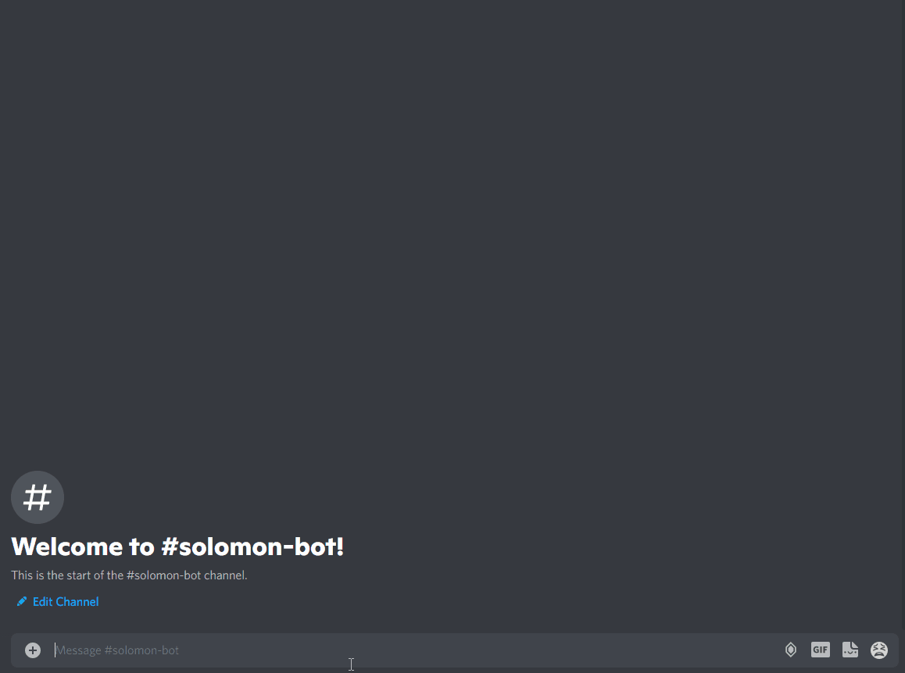

# solomon-bot

Your friendly Yu-Gi-Oh! OCG bot running on discord to help you find cards' price in English. The price references are scraped from [bigweb](https://bigweb.co.jp/) and [YUYU-TEI](https://yuyu-tei.jp/).



## For development

### Setup development environment

```sh
virtualenv venv
# For fish
source venv/bin/activate.fish
# For shell
source venv/bin/activate
pip install -r requirements.txt
```

### Environment variables

```env
# .env
DISCORD_TOKEN=<TOKEN>
```

### Running on local

```sh
# Run on machine
python src/main.py

# Run on docker
earthly +compose-up
earthly +compose-down
```

### Release

```sh
earthly --build-arg TAG=<TAG> --push +release
```
